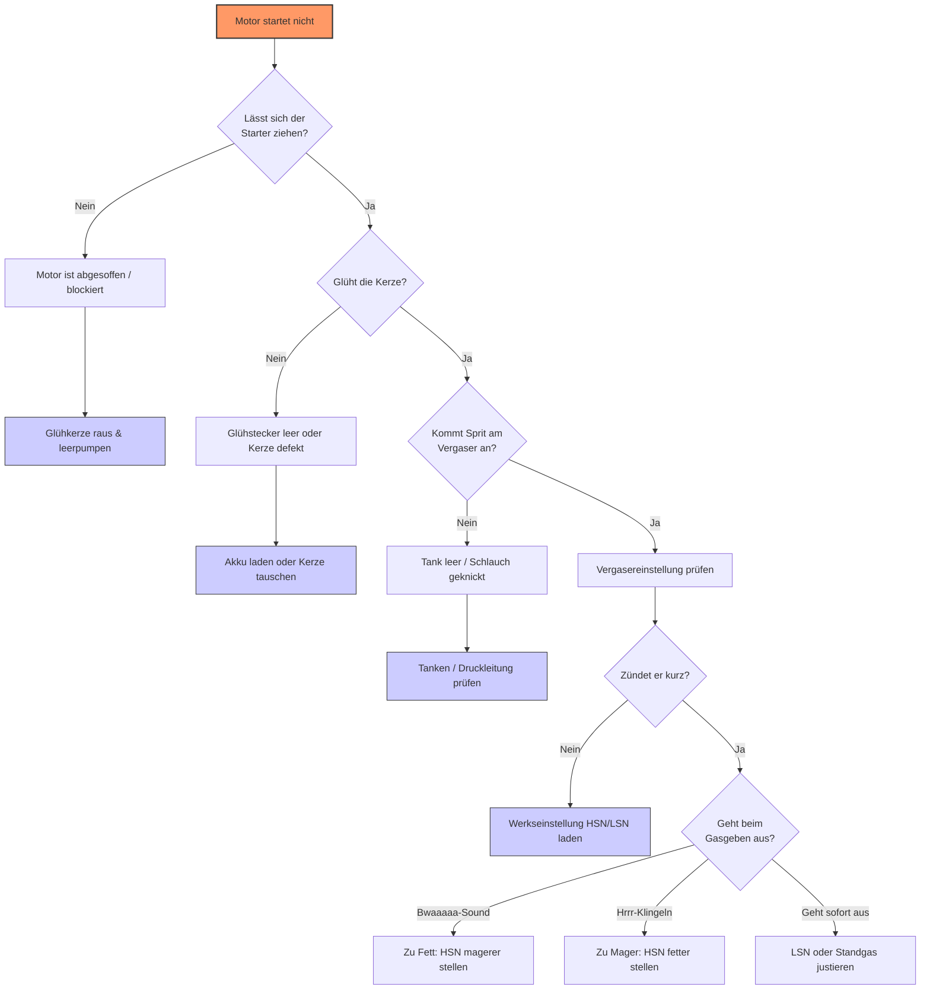

# 🛠️ Fehlersuche: Wenn der Nitro-Motor Probleme macht

Diese Liste hilft dir, die häufigsten Ursachen für Startprobleme oder schlechtes Laufverhalten deines Nitro-Motors zu finden und zu beheben.

## 🚫 Der Motor geht nicht an

* **Grund 1: Glühkerze glüht nicht**
    * Glühkerze prüfen.
* **Grund 2: Kein Kraftstoff im Vergaser**
    * Ist ausreichend Kraftsoff im Tank?
    * Ist der Kraftstoffschlauch geknickt?
    * Kraftstoff manuell zum Vergaser pumpen
* **Grund 3: Falsche Düsennadeleinstellung (Werkseinstellung verloren)**
    * Der Motor ist so stark verstellt, dass kein zündfähiges Gemisch entsteht.
    * **Maßnahme** : Bringen Sie die HSN (Hauptdüsennadel) und die LSN (Gemischschraube) zurück in die Werkseinstellung (Stock Settings) laut Handbuch. Meist bedeutet dies, die Nadeln vorsichtig ganz zu schließen und dann eine bestimmte Anzahl an Umdrehungen wieder zu öffnen.
* **Grund 4: Motor überflutet (Abgesoffen)**
    * **Problem**: Es befindet sich zu viel flüssiger Kraftstoff im Brennraum, wodurch die Glühkerze nicht mehr zünden kann und der Motor blockiert.
    * **Lösung**: 
      * Glühkerze mit einem Kerzenschlüssel ausbauen.
      * Ein Tuch über das Kerzenloch legen (Vorsicht: Sprit spritzt heraus!).
      * Den Seilzugstarter 5–10 Mal schnell durchziehen.
      * Glühkerze kurz am Glühstecker testen, wieder einbauen und erneut starten.

## ⚠️ Der Motor springt kurz an (erste Zündungen), stirbt aber sofort wieder ab.

* **Grund 1: Kraftstoffstau im Motor (abgesoffen)**
    * Der Motor hat beim Starten zu viel Sprit bekommen. 
    * **Lösung:** Kraftstoffschlauch kurz abziehen, Glühkerze herausschrauben und den Motor durchdrehen, um den Brennraum zu "lüften".
* **Grund 2: Vergasereinstellung im Leerlauf zu fett**
    * Das Gemisch ist zu kraftstoffreich, um stabil weiterzubrennen. 
    * **Lösung**: Die Gemischnadel (LSN) in winzigen Schritten (1/8 Umdrehung) im Uhrzeigersinn schließen.
* **Grund 3: Zu wenig Schwung beim Ziehen**
    * Etwas kräftiger und schneller ziehen.

## 📈 Drehzahl-Probleme

### Der Motor dreht hoch und geht aus
* **Grund:** Motor bekommt keinen Kraftstoff.
* **Maßnahme:** Modell betanken; Kraftstoffschlauch auf Knicke prüfen; Einstellung ist zu mager (LSN zu mager).

### Der Motor läuft, geht aber beim Gasgeben aus (Motor dreht nicht hoch)
* **Grund:** Leerlaufgemisch zu mager.
* **Maßnahme:** Gemischschraube in kleinen Schritten öffnen.

### Der Motor läuft, stottert und qualmt beim Gasgeben
* **Grund:** Leerlaufgemisch zu fett.
* **Maßnahme:** Gemischschraube in kleinen Schritten schließen.

### Der Motor bleibt stehen, wenn der Glühkerzenstecker abgezogen wird
* **Grund:** Leerlaufgemisch zu fett.
* **Maßnahme:** Gemischschraube in kleinen Schritten schließen.

## ⚙️ Mechanische Probleme

* **Der Motor blockiert**
    * Grund 1: Abgesoffen (siehe oben).
    * Grund 2: Verschmutzt -> Motor säubern.
* **Der Motor geht sehr leicht**
    * Grund: Geringe oder keine Kompression.
    * Maßnahme: Kerze auf festen Sitz prüfen; Zylinderkopfdichtung, Auspuffdichtung, Vergaserdichtung und Kerzendichtungsring prüfen.

## 🏁 Probleme bei Vollgas & Standgas

### Der Motor wirkt kraftlos, gibt ein dumpfes, tiefes Ansauggeräusch ("Bwaaaa") von sich und erreicht keine hohen Drehzahlen.
* **Grund:** Das Gemisch ist deutlich zu fett (zu viel Treibstoff, zu wenig Luft). Der Motor "ertrinkt" im Sprit.
* **Maßnahme:** Die High-Speed-Needle (HSN) in kleinen Schritten (1/8 Umdrehung) im Uhrzeigersinn schließen, bis der Motor frei hochdreht.

### Der Motor dreht zwar hoch, wirkt aber "gequält", läuft unruhig (wie ein stotterndes „hrrrr-rhr-rhrrr“) und die Drehzahl schwankt im Standgas stark nach oben.
* **Grund:** Der Motor bekommt zu wenig Sprit. Das Standgas steigt oft von alleine an, weil der Motor zu heiß wird.
* **Maßnahme:** Hauptdüsennadel (HSN) aufdrehen, um mehr Kraftstoff zur Kühlung und Schmierung zuzuführen.

### Motor dreht im Stand ohne Gasgeben hoch, Räder drehen los
* **Grund 1: Standgasschraube zu weit eingedreht**
    * Standgasschraube regulieren auf ca. 1mm Kükenspalt.
* **Grund 2: Gasservo falsch eingestellt**
    * Servo Neutralstellung und Failsavestellung überprüfen; Trimming an der Fernsteuerung einstellen.
* **Grund 3: LSN zu mager (Motor überhitzt oder dreht nicht hoch)**
    * Gemischnadel (LSN) fetter stellen.

